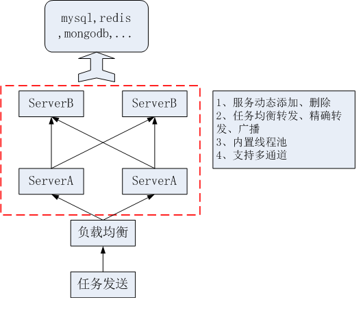
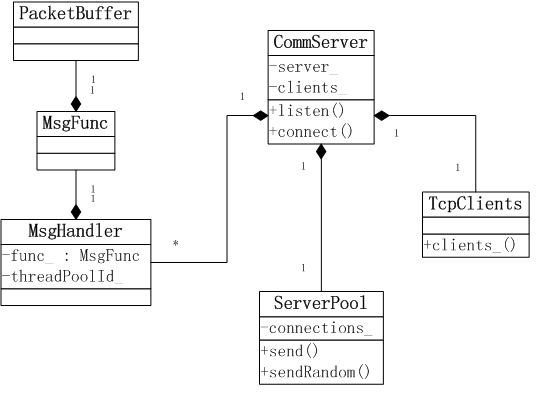

# CommServer
## 一个分布式的c++服务框架 ##
### 特点： ###
1. 基于muduo库，因此具有muduo库的高效性，且纯c++编写，只支持linux；
2. 封装服务转发、连接建立、线程池等逻辑，用户只需关注于业务代码的编写；

### 服务模型： ###

请先看图：

这是一个典型的分布式系统模型，对外请求通过“dns+负载均衡”转发到内部服务，内部服务分为多层，每层处理不同业务。红色虚框部分正是本框架要解决的问题，至于如何建立域名服务、如何搭建负载均衡、缓存与数据库如何设计则不是本框架所关心的。

那么需求来了：

1. 当业务增长时，如何实现服务动态扩容，而无需重启其他正在运行的服务？
2. 当服务器损坏、或业务量季节性地下降时，如何删除某些服务，而不至于影响到现有业务？
3. 任务如何在服务间高效均衡的转发？
4. 系统接入多个应用时，如何实现独享通道,以支持土豪用户？
5. 如何均衡处理阻塞io请求（mysql、redis等操作）和异步的tcp请求？
6. 通信协议如何设计？

### UML： ###

`class CommServer`: 主服务类，包括服务的监听、连接建立、消息的均衡转发等逻辑，也是用户直接使用的类；

`class ServerPool`: 服务池，包含与本服务连接的所有其他服务的活跃的connection，这是消息转发的依据；

`class TcpClients`： 基于muduo::TcpClient封装的TcpClient池，用于向多个其他服务发起连接；

`class MsgHandler`： 消息处理对象，当用户向CommServer注册MsgFunc时，会构造该对象，每个对象关联一个线程池，决定该类消息在哪个线程处理；

`class MsgFunc`： 消息处理函数，由用户定义，并向CommServer注册；

`class PacketBuffer`： 协议包缓冲类，CommServer解析出协议包，通过该类对象返回给用户的MsgFunc。

### 示例： ###
	
	// 以下代码见于 example/simple/server.cc
    #include <string>
    #include <unistd.h>
    #include <boost/shared_ptr.hpp>
    #include <muduo/base/Logging.h>
    #include <muduo/net/InetAddress.h>
    #include <commserv/CommServer.h>
    
    using namespace std;
    using namespace muduo;
    using namespace muduo::net;
    
    // 服务配置
    struct Config
    {
    	int appid;
    	int servtype;
    	int servno;
    	boost::shared_ptr<InetAddress> localAddr;
    	vector<InetAddress> remoteAddr;
    };
    // 解析命令行参数，源码可以从example下找到，简洁起见这里未列出
    bool parseArgs(int ac, char *av[], Config &cfg);
    // 主函数
    int main(int ac, char *av[])
    {
    	Config cfg;
    	//
    	if(!parseArgs(ac, av, cfg))
    	{
    		return -1;
    	}
    	// 设置muduo的日志级别
    	muduo::Logger::setLogLevel(muduo::Logger::DEBUG);
    	// 定义EventLoop
    	EventLoop loop;
		// 定义CommServer对象
    	CommServer server(&loop);
    	// 设置CommServer的基本信息，包括appid、servtype、servno，
		// 这是用于区别每个服务的三个参数
    	server.setServreInfo(cfg.appid, cfg.servtype, cfg.servno);
    	// 启动监听
		// 该步不是必要的，用户应根据实际需要决定是否需要开启监听端口
    	if(cfg.localAddr)
    	{
    		server.listen(cfg.localAddr->toIp(), cfg.localAddr->toPort());
    	}
    	// 主动连接其他服务
		// 该步不是必要的，用户应根据实际需要决定是否需要连接其他服务
    	for(int i = 0; i < cfg.remoteAddr.size(); ++i)
    	{
    		server.connect(cfg.remoteAddr[i].toIp(), cfg.remoteAddr[i].toPort());
    	}
		// 启动loop
    	loop.loop();
		//
    	return 0;
    }
    